# Database ERD

هذا ERD تأسيسي. سيتم توسيعه أثناء تنفيذ كل مرحلة، لكن العلاقات الأساسية تغطي المستخدمين، المعارض، السيارات، المزادات، الدفع، الفحص، الإعلانات، النزاعات، والتدقيق.

```mermaid
erDiagram
  users ||--o{ user_roles : has
  roles ||--o{ user_roles : assigned
  roles ||--o{ role_permissions : has
  permissions ||--o{ role_permissions : grants
  users ||--o{ user_documents : uploads
  users ||--o{ refresh_sessions : owns

  users ||--o| dealers : owns
  dealers ||--o{ dealer_staff : employs
  users ||--o{ dealer_staff : member
  dealers ||--o{ dealer_subscriptions : subscribes
  dealer_plans ||--o{ dealer_subscriptions : plan

  dealers ||--o{ vehicles : lists
  users ||--o{ vehicles : sells
  vehicles ||--o{ vehicle_images : has
  vehicles ||--o{ vehicle_videos : has
  vehicles ||--o{ vehicle_damage_reports : has
  vehicles ||--o{ vehicle_documents : has
  vehicles ||--o{ vehicle_snapshots : versioned

  auction_sessions ||--o{ auction_vehicles : contains
  auctions ||--o{ auction_vehicles : schedules
  vehicles ||--o{ auction_vehicles : listed
  auctions ||--o{ bids : receives
  users ||--o{ bids : places
  auctions ||--o| auction_results : produces

  users ||--o{ orders : creates
  orders ||--o{ payments : paid_by
  payments ||--o{ payment_transactions : tracks
  payment_providers ||--o{ payment_transactions : processes
  payments ||--o{ refunds : may_have
  users ||--o{ wallet_ledger : ledger

  technicians ||--o{ technician_services : offers
  users ||--o| technicians : profile
  vehicles ||--o{ inspection_requests : inspected
  users ||--o{ inspection_requests : requests
  technicians ||--o{ inspection_requests : assigned
  inspection_requests ||--o| inspection_reports : produces
  inspection_reports ||--o{ inspection_images : includes

  users ||--o{ favorites : saves
  users ||--o{ watchlists : watches
  users ||--o{ saved_searches : stores
  users ||--o{ notifications : receives

  support_tickets ||--o{ messages : contains
  disputes ||--o{ dispute_evidence : includes
  disputes ||--o{ messages : contains
  users ||--o{ reviews : writes

  advertisement_campaigns ||--o{ advertisements : contains
  advertisement_placements ||--o{ advertisements : placed

  cities ||--o{ regions : contains
  cities ||--o{ vehicles : location
  regions ||--o{ vehicles : area

  users ||--o{ audit_logs : actor
  users ||--o{ fraud_alerts : flagged
```

## ملاحظات تصميمية

- `vehicle_snapshots` تحفظ نسخة من بيانات السيارة وقت المزايدة أو بداية المزاد لحماية المستهلك.
- `wallet_ledger` ledger append-only، ولا يتم تعديل قيوده مباشرة.
- `payment_transactions` تسجل ردود مزود الدفع وWebhooks وحالة التوقيع.
- `audit_logs` لا تستخدم للحذف الدائم؛ عند الحاجة يتم إخفاء السجلات الحساسة حسب سياسات الخصوصية مع الاحتفاظ بالأثر القانوني.

